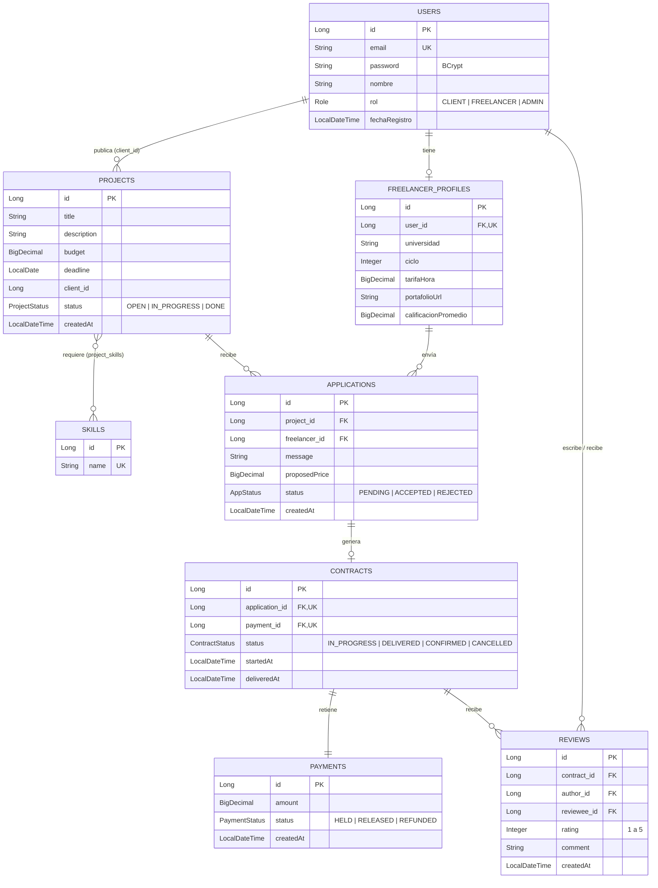

# DevUTEC — Plataforma freelance con pago en garantía para desarrolladores junior

**Curso:** CS 2031 Desarrollo Basado en Plataforma — UTEC, 2026-2

**Integrantes:**

| Nombre completo | Código | Usuario de GitHub |
|---|---|---|
| Alisson Luciana Breña Dávila | 202410064 | [@alissonbrena-dotcom](https://github.com/alissonbrena-dotcom) |
| Camila Gomez Arias | 202510093 | [@camilagomeza-lgtm](https://github.com/camilagomeza-lgtm) |
| Ariana Alejandra Isla Urbina | 202510309 | [@aisla9](https://github.com/aisla9), [@aaariana9](https://github.com/aaariana9) |
| Nicole Valeria Yucra Castro | 202510210 | [@ny216](https://github.com/ny216), [@nicoleyucra1](https://github.com/nicoleyucra1) |

**API desplegada (AWS EC2 + RDS):** `http://ec2-52-7-186-192.compute-1.amazonaws.com:8080`

---

## Índice

1. [Introducción](#introducción)
2. [Identificación del problema o necesidad](#identificación-del-problema-o-necesidad)
3. [Descripción de la solución](#descripción-de-la-solución)
4. [Modelo de entidades](#modelo-de-entidades)
5. [Manejo de errores](#manejo-de-errores)
6. [Medidas de seguridad implementadas](#medidas-de-seguridad-implementadas)
7. [Eventos y asincronía](#eventos-y-asincronía)
8. [GitHub & Management](#github--management)
9. [Guía de uso](#guía-de-uso)
10. [Conclusión](#conclusión)
11. [Apéndices](#apéndices)

---

## Introducción

### Contexto

Los estudiantes de Ciencias de la Computación tienen las competencias para construir software real, pero les cuesta conseguir su primer trabajo pagado. Al mismo tiempo, los negocios pequeños necesitan proyectos puntuales y no encuentran talento accesible y confiable. DevUTEC es el backend de una plataforma que conecta a ambos con reglas claras y un pago protegido para las dos partes.

### Objetivos del proyecto

- Permitir que los clientes **publiquen proyectos** con presupuesto, plazo y habilidades requeridas, y que los freelancers **postulen** con una propuesta y un precio.
- Implementar un **pago en garantía (escrow)**: el dinero queda retenido al aceptar una postulación y solo se libera al freelancer cuando el cliente confirma la entrega; si el contrato se cancela, se reembolsa.
- Construir **reputación verificable** mediante reseñas entre cliente y freelancer al cerrar cada contrato.
- Ofrecer una **API REST segura** (JWT y roles), con notificaciones por correo asíncronas y desplegada en la nube.

---

## Identificación del problema o necesidad

### Descripción del problema

El problema tiene dos públicos:

- **El freelancer junior**: estudiante de CS que busca su primera experiencia remunerada. En las plataformas grandes pierde frente a perfiles senior, y en canales informales trabaja sin garantía de cobro.
- **El cliente**: emprendedor o negocio pequeño que necesita un proyecto puntual, no sabe cómo evaluar a un desarrollador y teme pagar por un trabajo que quizá no llegue.

La raíz común es la **falta de confianza entre dos partes que no se conocen**.

### Justificación

El estudiante gana experiencia, ingresos y un historial verificable; el negocio obtiene software accesible pagando solo por lo que recibe. El pago en garantía y las reseñas reemplazan la confianza personal por reglas que la plataforma hace cumplir.

---

## Descripción de la solución

### Funcionalidades implementadas

| Funcionalidad | Cómo contribuye a resolver el problema |
|---|---|
| **Registro y login con roles** (`CLIENT`, `FREELANCER`, `ADMIN`) | Cada usuario solo hace lo que le corresponde; el freelancer obtiene un perfil profesional. |
| **Publicación de proyectos** y **búsqueda con filtros y paginación** | El cliente describe lo que necesita; el freelancer encuentra proyectos acordes a su perfil. |
| **Postulaciones** con mensaje y precio | El cliente compara propuestas y acepta una; las demás se rechazan automáticamente. |
| **Contrato con pago en garantía (escrow)** | El pago queda retenido (`HELD`) al aceptar, se libera (`RELEASED`) al confirmar la entrega y se reembolsa (`REFUNDED`) si se cancela. |
| **Reseñas bidireccionales** y **calificación promedio** | Cada parte califica a la otra (1–5); el freelancer acumula reputación pública. |
| **Notificaciones por correo** asíncronas | Avisan de cada etapa: postulación, aceptación, entrega, pago liberado y reseña. |

### Tecnologías utilizadas

| Categoría | Tecnología |
|---|---|
| Lenguaje y framework | Java 21, Spring Boot 4.1 (Web MVC, Data JPA, Security, Validation, Mail) |
| Base de datos | PostgreSQL 16 (Docker Compose en local, Amazon RDS en producción) |
| Seguridad | JWT con jjwt 0.12, BCrypt, Spring Security con `@PreAuthorize` |
| Mapeo y utilidades | ModelMapper, Lombok, SLF4J |
| Correo | JavaMailSender con plantillas Thymeleaf y Mailtrap (sandbox SMTP) |
| Pruebas | JUnit 5 y Mockito; colección de Postman ejecutada con Newman |
| DevOps | Maven, GitHub Actions (CI), AWS EC2 + RDS con Elastic IP |

---

## Modelo de entidades

### Diagrama entidad-relación



### Descripción de las entidades

| Entidad | Rol en el sistema |
|---|---|
| **User** | Cuenta de acceso con email único, contraseña cifrada y rol. |
| **FreelancerProfile** | Datos profesionales del freelancer (1:1 con `User`), incluida su calificación promedio. |
| **Project** | Trabajo publicado por un cliente, con presupuesto, plazo y estado. |
| **Skill** | Habilidad técnica; se relaciona N:M con los proyectos. |
| **Application** | Postulación de un freelancer a un proyecto; única por par (proyecto, freelancer). |
| **Contract** | Se crea al aceptar una postulación (1:1) y controla el ciclo de entrega. |
| **Payment** | Pago en garantía asociado al contrato (1:1); se persiste en cascada al crear el contrato. |
| **Review** | Reseña de un participante a otro; única por par (contrato, autor). |

**Decisiones de diseño:** todas las relaciones usan `FetchType.LAZY` y las consultas que necesitan datos relacionados cargan solo lo necesario con `@EntityGraph`. La integridad se refuerza en la base de datos con claves únicas (`email`, `skill.name`, `(project_id, freelancer_id)`, `(contract_id, author_id)`), un `CHECK` para `rating` entre 1 y 5 y un índice en `reviews.reviewee_id` para el perfil público.

---

## Manejo de errores

Todos los errores se centralizan en un `@RestControllerAdvice` (`GlobalExceptionHandler`) y se devuelven con un formato único (`ErrorResponseDTO`), para que el cliente de la API siempre sepa qué falló sin exponer detalles internos:

```json
{ "timestamp": "2026-09-25T16:21:28", "status": 409, "error": "Conflict",
  "message": "Ya postulaste a este proyecto", "path": "/api/v1/applications" }
```

**Excepciones personalizadas.** Heredan de `ApiException`, que guarda el código HTTP, así un solo manejador las cubre a todas:

| Excepción | HTTP | Ejemplo de uso |
|---|---|---|
| `ResourceNotFoundException` | 404 | Proyecto, contrato o usuario inexistente |
| `DuplicateResourceException` | 409 | Email ya registrado, postulación o reseña repetida |
| `ConflictException` → `InvalidPaymentStateException` | 409 | Liberar un pago que no está retenido |
| `InvalidOperationException` | 409 | Transición de estado inválida (confirmar sin entrega) |
| `ForbiddenOperationException` | 403 | Modificar el proyecto o contrato de otro usuario |
| `UnauthorizedException` | 401 | Refresh token inválido o sin sesión |
| `EmailSendingException` | 503 | Fallo del servidor de correo (tarea asíncrona) |

**Excepciones de Spring manejadas:** validación de `@Valid` y de parámetros (400), JSON mal formado (400), credenciales incorrectas (401), acceso denegado (403), ruta inexistente (404), método no permitido (405), clave duplicada en base de datos (409), `Content-Type` no soportado (415) y cualquier error inesperado (500, registrado en el log con su stacktrace).

**Por qué es importante:** sin este manejo, cada error llegaría como un 500 genérico o con el stacktrace de Java, confundiendo al cliente y filtrando información interna. Los errores de tareas asíncronas se capturan aparte con un `AsyncUncaughtExceptionHandler`.

---

## Medidas de seguridad implementadas

### Seguridad de datos

- **Autenticación con JWT.** El login devuelve un *access token* (15 min) y un *refresh token* (7 días), firmados con HMAC. El token lleva los claims `userId`, `role` y `type`; un `JwtAuthenticationFilter` lo valida en cada petición y rechaza los refresh tokens usados como access. La clave se lee de la variable de entorno `JWT_SECRET`.
- **Contraseñas cifradas con BCrypt**, con validación de fortaleza (mínimo 8 caracteres, letras y números). Nunca se devuelven en las respuestas: la API solo expone DTOs.
- **Autorización por roles y por propiedad.** 15 endpoints usan `@PreAuthorize` según el rol; además, los servicios verifican con el usuario autenticado del `SecurityContext` que solo el dueño modifique su proyecto, que solo los participantes vean un contrato y que el cliente se tome del token y no del body. El registro como `ADMIN` está bloqueado.
- **Sesiones sin estado** (`STATELESS`) y CORS limitado a los orígenes del frontend.

### Prevención de vulnerabilidades

| Vulnerabilidad | Medida |
|---|---|
| **Inyección SQL** | Todas las consultas pasan por Spring Data JPA (métodos derivados, `Specification` y JPQL con parámetros); no hay SQL armado concatenando texto. |
| **XSS** | La API solo responde JSON y valida las entradas con Bean Validation; las plantillas de correo usan `th:text`, que escapa el HTML. |
| **CSRF** | Deshabilitado a propósito: la API no usa cookies de sesión, el token viaja en el header `Authorization`, así que un sitio externo no puede enviarlo por el usuario. |
| **Enumeración de usuarios** | El login responde siempre "Email o contraseña incorrectos", sin revelar si el email existe. |

**En producción (AWS):** solo el puerto 8080 está abierto a internet; el SSH acepta únicamente EC2 Instance Connect y RDS no es accesible desde fuera. Las credenciales nunca se suben al repositorio.

---

## Eventos y asincronía

Los servicios publican **eventos de dominio** (`ApplicationEvent`) y no conocen a quién los procesa; los *listeners* reaccionan por separado. Así, agregar una nueva reacción no requiere modificar la lógica de negocio.

| Evento | Se publica cuando... | Listener → acción |
|---|---|---|
| `ApplicationCreatedEvent` | un freelancer postula | `ApplicationNotifier` → correo al cliente |
| `ApplicationAcceptedEvent` | el cliente acepta una postulación | `ApplicationNotifier` → correo al freelancer |
| `ContractDeliveredEvent` | el freelancer entrega el trabajo | `ContractNotifier` → correo al cliente |
| `PaymentReleasedEvent` | el cliente confirma y se libera el pago | `PaymentReleasedNotifier` → correo al freelancer |
| `ReviewCreatedEvent` | se registra una reseña | `FreelancerRatingUpdater` → recalcula la calificación promedio; `ReviewNotifier` → correo al reseñado |

Todos los listeners usan `@TransactionalEventListener`, por lo que **solo se ejecutan si la transacción se confirmó**: nunca se envía un correo de "pago liberado" si la operación se revirtió. Los correos usan plantillas HTML con Thymeleaf.

**Por qué son asíncronos:** enviar un correo depende de un servidor SMTP externo que puede tardar o fallar. Con `@Async`, la API responde de inmediato y el envío ocurre en segundo plano, en un `ThreadPoolTaskExecutor` propio (5 a 10 hilos, cola de 25); si falla, no afecta la operación principal. En el deploy se verificó que llegan los 5 correos del flujo.

---

## GitHub & Management

**Organización de tareas.** El trabajo se dividió en **issues** por módulo, cada uno asignado a una integrante y etiquetado con un *label* (`auth`, `projects`, `contracts`, `payments`), con checklists de subtareas. Los 13 issues del proyecto se cerraron, varios automáticamente al unir el PR correspondiente (`Closes #12`).

**Flujo de trabajo.** Cada funcionalidad se desarrolló en su propia rama (`feature/…`, `fix/…`, `docs/…`) y se integró a `main` mediante **pull request**: 26 PRs unidos, 14 con aprobación explícita. Las revisiones detectaron problemas reales antes del merge, como vulnerabilidades en el registro y pruebas faltantes.

**GitHub Actions (CI).** El workflow `.github/workflows/ci.yml` se ejecuta en cada push y pull request a `main`: levanta un contenedor de PostgreSQL 16, instala Java 21 y ejecuta `./mvnw verify`, que compila el proyecto y corre toda la suite de pruebas. Un PR con el build en rojo no se integra, lo que mantiene `main` siempre funcional.

---

## Guía de uso

### Ejecución local

Requisitos: Java 21 y Docker.

```bash
git clone https://github.com/alissonbrena-dotcom/devutec-backend.git
cd devutec-backend
docker compose up -d          # PostgreSQL 16 en localhost:5432
./mvnw spring-boot:run        # API en http://localhost:8080
./mvnw test                   # suite de pruebas
```

### Variables de entorno

| Variable | Uso | Valor por defecto |
|---|---|---|
| `DB_URL`, `DB_USERNAME`, `DB_PASSWORD` | Conexión a PostgreSQL | Base local de Docker Compose |
| `JWT_SECRET` | Clave de firma de los tokens | Solo para desarrollo; **obligatorio cambiarla en producción** |
| `JWT_ACCESS_EXPIRATION_MS`, `JWT_REFRESH_EXPIRATION_MS` | Duración de los tokens | 15 min y 7 días |
| `MAIL_USERNAME`, `MAIL_PASSWORD` | Credenciales SMTP de Mailtrap | Sin valor: la API funciona, pero no envía correos |

### Endpoints

Todos bajo `/api/v1`. Salvo los públicos, requieren el header `Authorization: Bearer <token>`.

| Módulo | Endpoints | Acceso |
|---|---|---|
| Auth | `POST /auth/register`, `/auth/login`, `/auth/refresh` | Público |
| Skills | `GET /skills`, `GET /skills/{id}` · `POST /skills` · `DELETE /skills/{id}` | Autenticado · CLIENT/ADMIN · ADMIN |
| Projects | `GET /projects` (filtros y paginación), `GET /projects/{id}` · `POST /projects` · `PUT`, `DELETE /projects/{id}` | Autenticado · CLIENT · dueño o ADMIN |
| Applications | `POST /applications`, `GET /applications/me`, `DELETE /applications/{id}` · `GET /applications?projectId=`, `PATCH /applications/{id}/accept`, `/reject` · `GET /applications/{id}` | FREELANCER · CLIENT dueño · participantes |
| Contracts | `GET /contracts/me`, `GET /contracts/{id}` · `PATCH /contracts/{id}/deliver` · `/confirm`, `/cancel` | Participantes · FREELANCER · CLIENT |
| Reviews | `POST`, `GET /contracts/{id}/reviews` · `GET /users/{id}/reviews` (paginado, `minRating`) | Participantes · Público |
| Payments | `GET /payments`, `GET /payments/{id}` | ADMIN |

La documentación completa, con descripciones y ejemplos de cada respuesta, está en la colección [`postman_collection.json`](postman_collection.json). Ejecutando las carpetas en orden se recorre el flujo completo del negocio.

### Deploy

La API está desplegada en **AWS**: la aplicación corre en una instancia **EC2** con **Elastic IP** y la base de datos en **Amazon RDS** (PostgreSQL). Las variables de entorno se configuran en el servidor, y los *security groups* solo exponen el puerto 8080.

**URL:** http://ec2-52-7-186-192.compute-1.amazonaws.com:8080

---

## Conclusión

### Logros del proyecto

Se construyó un backend desplegado que resuelve el problema de confianza entre clientes y freelancers junior: el flujo publicar → postular → contratar → entregar → pagar → reseñar funciona de punta a punta en producción, con pago en garantía y reputación verificable, respaldado por JWT, roles, eventos asíncronos y 54 pruebas unitarias en CI.

### Aprendizajes clave

- Las **reglas de negocio** (estados del contrato y del pago) deben validarse en los servicios y en la base de datos.
- La seguridad no es solo autenticar: hay que verificar **quién es dueño** de cada recurso.
- Las **revisiones de código** detectaron errores que las pruebas no cubrían.
- Desplegar en la nube implica configurar redes, secretos y accesos.

### Trabajo futuro

- Chat con IA que convierta la necesidad del cliente en un brief técnico y recomiende freelancers.
- Pagos reales con Stripe, verificación de portafolio con GitHub y agendamiento con Cal.com.
- Límite de intentos de login y reintentos automáticos para correos rechazados por el proveedor.
- Carga de entregables y portafolios a Amazon S3.

---

## Apéndices

### Licencia

Distribuido bajo la licencia **MIT**. Ver el archivo [`LICENSE`](LICENSE).

### Referencias

- [Documentación de Spring Boot](https://docs.spring.io/spring-boot/)
- [Spring Security Reference](https://docs.spring.io/spring-security/reference/)
- [Spring Data JPA Reference](https://docs.spring.io/spring-data/jpa/reference/)
- [JJWT — Java JWT](https://github.com/jwtk/jjwt)
- [Amazon EC2](https://docs.aws.amazon.com/ec2/) y [Amazon RDS](https://docs.aws.amazon.com/rds/)
- [Mailtrap Email Testing](https://docs.mailtrap.io/)
