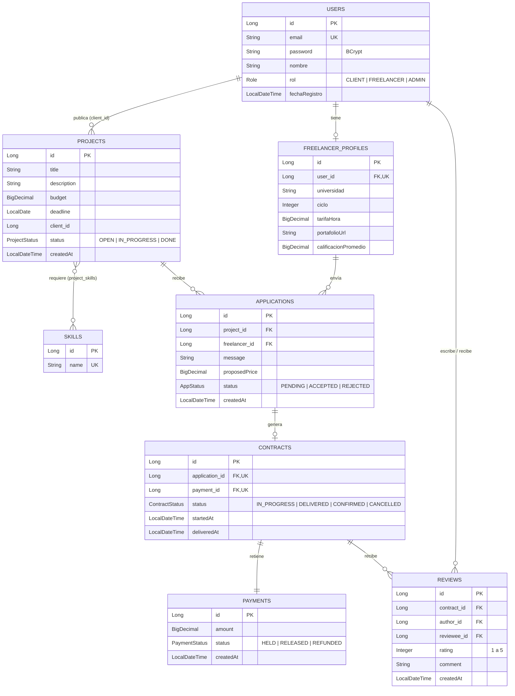

# DevUTEC — Plataforma freelance con pago en garantía para desarrolladores junior

**Curso:** CS 2031 Desarrollo Basado en Plataforma — UTEC, 2026-2

**Integrantes:**

| Nombre completo | Código | Usuario de GitHub |
|---|---|---|
| Alisson Luciana Breña Dávila | 202410064 | [@alissonbrena-dotcom](https://github.com/alissonbrena-dotcom) |
| Camila Gomez Arias | 202510093 | [@camilagomeza-lgtm](https://github.com/camilagomeza-lgtm) |
| Ariana Alejandra Isla Urbina | 202510309 | [@aisla9](https://github.com/aisla9), [@aaariana9](https://github.com/aaariana9) |
| Nicole Valeria Yucra Castro | 202510210 | [@ny216](https://github.com/ny216), [@nicoleyucra1](https://github.com/nicoleyucra1) |

**API desplegada (AWS EC2 + RDS):** `http://ec2-52-7-186-192.compute-1.amazonaws.com:8080`

---

## Índice

1. [Introducción](#introducción)
2. [Identificación del problema o necesidad](#identificación-del-problema-o-necesidad)
3. [Descripción de la solución](#descripción-de-la-solución)
4. [Modelo de entidades](#modelo-de-entidades)
5. [Manejo de errores](#manejo-de-errores)
6. [Medidas de seguridad implementadas](#medidas-de-seguridad-implementadas)
7. [Eventos y asincronía](#eventos-y-asincronía)
8. [GitHub & Management](#github--management)
9. [Guía de uso](#guía-de-uso)
10. [Conclusión](#conclusión)
11. [Apéndices](#apéndices)

---

## Introducción

### Contexto

Los estudiantes de Ciencias de la Computación tienen las competencias para construir software real, pero les cuesta conseguir su primer trabajo pagado. Al mismo tiempo, los negocios pequeños necesitan proyectos puntuales y no encuentran talento accesible y confiable. DevUTEC es el backend de una plataforma que conecta a ambos con reglas claras y un pago protegido para las dos partes.

### Objetivos del proyecto

- Permitir que los clientes **publiquen proyectos** con presupuesto, plazo y habilidades requeridas, y que los freelancers **postulen** con una propuesta y un precio.
- Implementar un **pago en garantía (escrow)**: el dinero queda retenido al aceptar una postulación y solo se libera al freelancer cuando el cliente confirma la entrega; si el contrato se cancela, se reembolsa.
- Construir **reputación verificable** mediante reseñas entre cliente y freelancer al cerrar cada contrato.
- Ofrecer una **API REST segura** (JWT y roles), con notificaciones por correo asíncronas y desplegada en la nube.

---

## Identificación del problema o necesidad

### Descripción del problema

El problema tiene dos públicos:

- **El freelancer junior**: estudiante de CS que busca su primera experiencia remunerada. En las plataformas grandes pierde frente a perfiles senior, y en canales informales trabaja sin garantía de cobro.
- **El cliente**: emprendedor o negocio pequeño que necesita un proyecto puntual, no sabe cómo evaluar a un desarrollador y teme pagar por un trabajo que quizá no llegue.

La raíz común es la **falta de confianza entre dos partes que no se conocen**.

### Justificación

El estudiante gana experiencia, ingresos y un historial verificable; el negocio obtiene software accesible pagando solo por lo que recibe. El pago en garantía y las reseñas reemplazan la confianza personal por reglas que la plataforma hace cumplir.

---

## Descripción de la solución

### Funcionalidades implementadas

| Funcionalidad | Cómo contribuye a resolver el problema |
|---|---|
| **Registro y login con roles** (`CLIENT`, `FREELANCER`, `ADMIN`) | Cada usuario solo hace lo que le corresponde; el freelancer obtiene un perfil profesional. |
| **Publicación de proyectos** y **búsqueda con filtros y paginación** | El cliente describe lo que necesita; el freelancer encuentra proyectos acordes a su perfil. |
| **Postulaciones** con mensaje y precio | El cliente compara propuestas y acepta una; las demás se rechazan automáticamente. |
| **Contrato con pago en garantía (escrow)** | El pago queda retenido (`HELD`) al aceptar, se libera (`RELEASED`) al confirmar la entrega y se reembolsa (`REFUNDED`) si se cancela. |
| **Reseñas bidireccionales** y **calificación promedio** | Cada parte califica a la otra (1–5); el freelancer acumula reputación pública. |
| **Notificaciones por correo** asíncronas | Avisan de cada etapa: postulación, aceptación, entrega, pago liberado y reseña. |

### Tecnologías utilizadas

| Categoría | Tecnología |
|---|---|
| Lenguaje y framework | Java 21, Spring Boot 4.1 (Web MVC, Data JPA, Security, Validation, Mail) |
| Base de datos | PostgreSQL 16 (Docker Compose en local, Amazon RDS en producción) |
| Seguridad | JWT con jjwt 0.12, BCrypt, Spring Security con `@PreAuthorize` |
| Mapeo y utilidades | ModelMapper, Lombok, SLF4J |
| Correo | JavaMailSender con plantillas Thymeleaf y Mailtrap (sandbox SMTP) |
| Pruebas | JUnit 5 y Mockito; colección de Postman ejecutada con Newman |
| DevOps | Maven, GitHub Actions (CI), AWS EC2 + RDS con Elastic IP |

---

## Modelo de entidades

### Diagrama entidad-relación



### Descripción de las entidades

| Entidad | Rol en el sistema |
|---|---|
| **User** | Cuenta de acceso con email único, contraseña cifrada y rol. |
| **FreelancerProfile** | Datos profesionales del freelancer (1:1 con `User`), incluida su calificación promedio. |
| **Project** | Trabajo publicado por un cliente, con presupuesto, plazo y estado. |
| **Skill** | Habilidad técnica; se relaciona N:M con los proyectos. |
| **Application** | Postulación de un freelancer a un proyecto; única por par (proyecto, freelancer). |
| **Contract** | Se crea al aceptar una postulación (1:1) y controla el ciclo de entrega. |
| **Payment** | Pago en garantía asociado al contrato (1:1); se persiste en cascada al crear el contrato. |
| **Review** | Reseña de un participante a otro; única por par (contrato, autor). |

**Decisiones de diseño:** todas las relaciones usan `FetchType.LAZY` y las consultas que necesitan datos relacionados cargan solo lo necesario con `@EntityGraph`. La integridad se refuerza en la base de datos con claves únicas (`email`, `skill.name`, `(project_id, freelancer_id)`, `(contract_id, author_id)`), un `CHECK` para `rating` entre 1 y 5 y un índice en `reviews.reviewee_id` para el perfil público.

---

## Manejo de errores

Todos los errores se centralizan en un `@RestControllerAdvice` (`GlobalExceptionHandler`) y se devuelven con un formato único (`ErrorResponseDTO`), para que el cliente de la API siempre sepa qué falló sin exponer detalles internos:

```json
{ "timestamp": "2026-09-25T16:21:28", "status": 409, "error": "Conflict",
  "message": "Ya postulaste a este proyecto", "path": "/api/v1/applications" }
```

**Excepciones personalizadas.** Heredan de `ApiException`, que guarda el código HTTP, así un solo manejador las cubre a todas:

| Excepción | HTTP | Ejemplo de uso |
|---|---|---|
| `ResourceNotFoundException` | 404 | Proyecto, contrato o usuario inexistente |
| `DuplicateResourceException` | 409 | Email ya registrado, postulación o reseña repetida |
| `ConflictException` → `InvalidPaymentStateException` | 409 | Liberar un pago que no está retenido |
| `InvalidOperationException` | 409 | Transición de estado inválida (confirmar sin entrega) |
| `ForbiddenOperationException` | 403 | Modificar el proyecto o contrato de otro usuario |
| `UnauthorizedException` | 401 | Refresh token inválido o sin sesión |
| `EmailSendingException` | 503 | Fallo del servidor de correo (tarea asíncrona) |

**Excepciones de Spring manejadas:** validación de `@Valid` y de parámetros (400), JSON mal formado (400), credenciales incorrectas (401), acceso denegado (403), ruta inexistente (404), método no permitido (405), clave duplicada en base de datos (409), `Content-Type` no soportado (415) y cualquier error inesperado (500, registrado en el log con su stacktrace).

**Por qué es importante:** sin este manejo, cada error llegaría como un 500 genérico o con el stacktrace de Java, lo que confunde al cliente y filtra información interna. Los errores de tareas asíncronas (como el envío de correos) no llegan a ningún controlador, por eso se capturan aparte con un `AsyncUncaughtExceptionHandler` que los registra sin afectar la respuesta al usuario.
